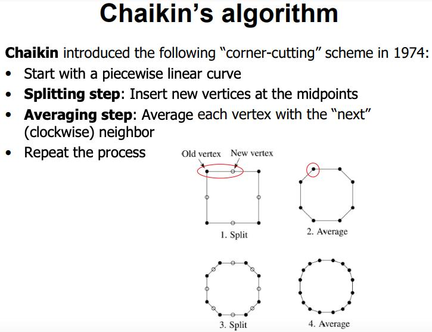
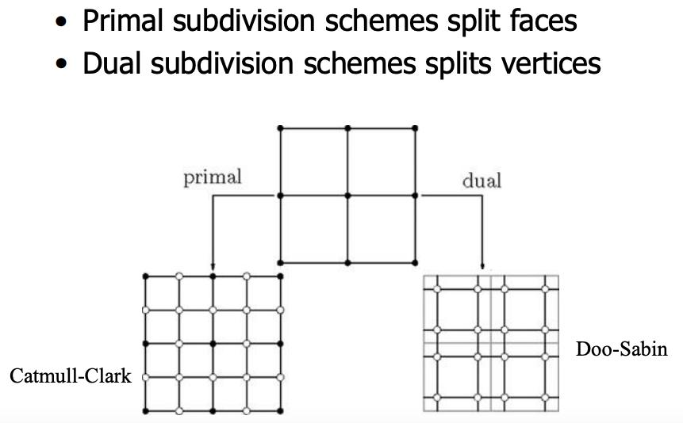
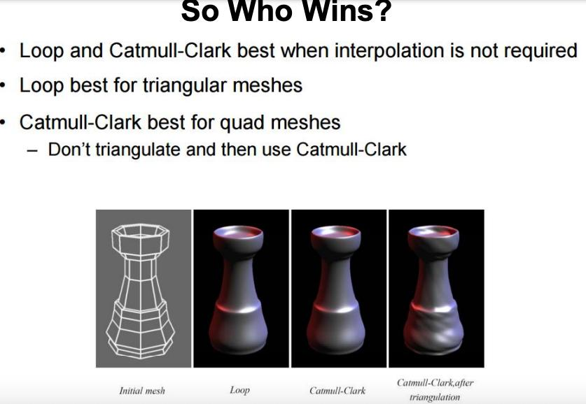

# Subdivision surfaces 细分表面
refine 提炼，精炼 / affine adj. 仿射(几何学)的 姻亲

分段线性曲线 piecewise linear curve
infinite subdivision method 无限细分法  
Recipe for XX: XX 的诀窍  

primal 即每次都是从中间分开。
dual  
• The valence of each internal vertex is 6 for triangle meshes  
• 三角形网格的每个内部顶点的价数为 6
因为很多时候我们无法把每个点都画出来，只能是先画出一部分点，然后呢，通过smooth的手段来细化。

crease n. 摺痕；皱纹；折缝；球门区（crease的复数）
