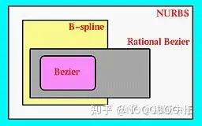

# 这个文件的意义在于我想把Parametric Curves and Surfaces 这个章节的重要的数学推到公式拿到这里来。
[https://pages.mtu.edu/~shene/COURSES/cs3621/NOTES/spline/Bezier/bezier-der.html](https://pages.mtu.edu/~shene/COURSES/cs3621/NOTES/spline/Bezier/bezier-der.html)  
[https://math.aalto.fi/~ahniemi/hss2012/](https://math.aalto.fi/~ahniemi/hss2012/)  
[胡事民教授《计算机图形学》](https://cg.cs.tsinghua.edu.cn/course/)
这个网站是可以用来绘图  

Evaluating 计算 Bézier Curves (de Casteljau Algorithm)
我理解就是 cubic 是4个点，但是被称做 cubic bézier curve, in order to 。通过少量的点就能画出bezier曲线
所以使用了这种简化方案。即通过计算可以发现，少量的点就可以得到我们想要的贝塞尔曲线。
 
[https://sites.cs.ucsb.edu/~lingqi/teaching/resources/GAMES101_Lecture_11.pdf](https://sites.cs.ucsb.edu/~lingqi/teaching/resources/GAMES101_Lecture_11.pdf)

上图的意思是说
伯恩施坦多项式 (Bernstein polynomial)
对于[0, 1]区间上任意连续函数 f(x) 和任意正整数n，在n趋于无穷的时候，Bernstein多项式可以一致逼近 f(x)。
简单来说就是将原本的f(x)用很多参数？
还是用很多algebraic symbolic 来代替插值，当n趋向于无穷大大时候，就会变成原来的函数本身从而最大程度上拟合原本的函数。

然后，我们来讲一下怎么计算这个n取i，就是

三种方案表示一个图形
Explicit representation: give the vertices and coordinates directly
Implicit representation: use the function to represent the graph
parametric representation: 

讲完了图形，紧接着就开始讲起来了如何做smoothing这些个图形？问题：一个explicit representation的图形，
能不能用来做 implicit smoothing呢？
可以的，因为什么呢？以我们做的project为例，就是在针对一个实际的点+face去做的smoothing
这里又引出来了另外的一个知识点，为什么我们要将函数分解成为一个多项式？这些多项式的参数，其实对应的就是一个可以用来影响结果的
系数，然后使用这些系数呢，可以最大程度上满足不同的求解要求。（RBF就是高斯函数在高维的情况，我们同样可以通过把RBF函数作为基函数实现函数拟合。）
NURBS是非均匀有理B样条（Non-Uniform Rational B-Splines）的缩写。

