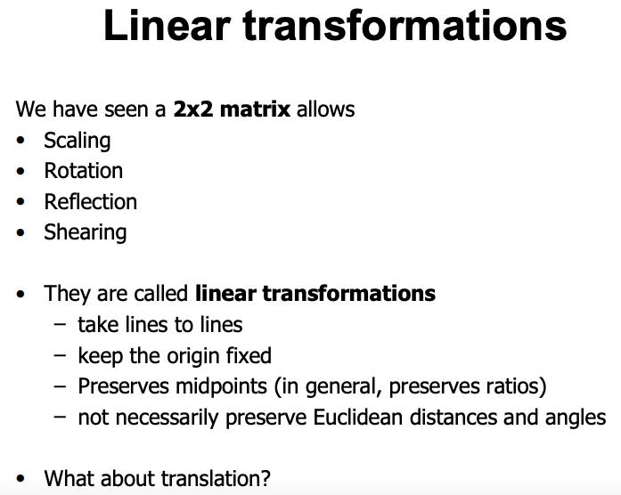
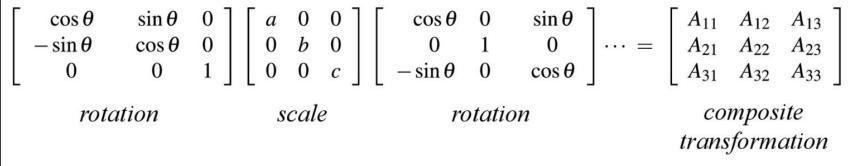

# COMP5411-L1-Advanced-Computer-Graphics

# what's the difference between tranformation and translation?
transformation keeps the middle point  
Translation is an affine transformation 仿射变换 (unlike linear transformations, it need not preserve origin)
这里给出了3个结论：  
1 2D translation cannot be represented by a 2x2 matrix.  
2 Translation is an affine transformation (unlike linear transformations, it need not preserve origin)
3 An important computer graphics magic trick to turn affine transformations to linear transformations is to use homogeneous coordinates  
什么是 homogeneous coordinates：齐次坐标 (Homogeneous coordinates) 在数学里，齐次坐标，或投影坐标是指一个用于投影几何里的坐标系统，如同用于欧氏几何里的笛卡儿坐标一般。该词由奥古斯特·费迪南德·莫比乌斯于1827年在其著作《Der barycentrische Calcul》一书内引入。齐次坐标可让包括无穷远点的点坐标以有限坐标表示。
以上是通过齐次坐标来区分向量和点的方式。从中可以思考得知，对于平移T、旋转R、缩放S这3个最常见的仿射变换，平移变换只对于点才有意义，因为普通向量没有位置概念，只有大小和方向.  
因此，如果把一个点从普通坐标变成齐次坐标，给x,y,z乘上同一个非零数w，然后增加第4个分量w；如果把一个齐次坐标转换成普通坐标，把前三个坐标同时除以第4个坐标，然后去掉第4个分量。  
齐次：就是阶数相同，不是x2+2y这种。另外使用增加一个维度的 （a, b, c, h）可以用齐次坐标来表示点和线段，从而能够将使用一致的逻辑来计算各类的变换。  

# Why care about representing transformations as matrices?   
• Composition of transformations is matrix product 多次变化可以视作矩阵的乘法  
• Product of many matrices is a single matrix 多个矩阵的乘法可以变成一个单一的矩阵，而且是一个固定维度的矩阵  
• Gives uniform representation of transformations    
• Simplifies graphics algorithms, systems (e.g., GPUs & APIs)  
