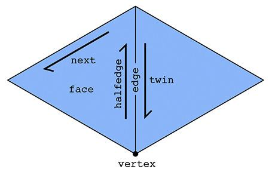
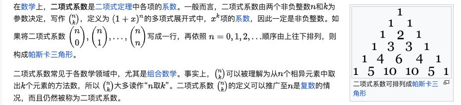
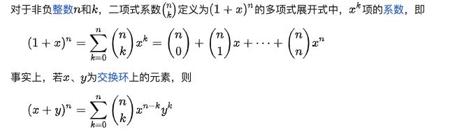
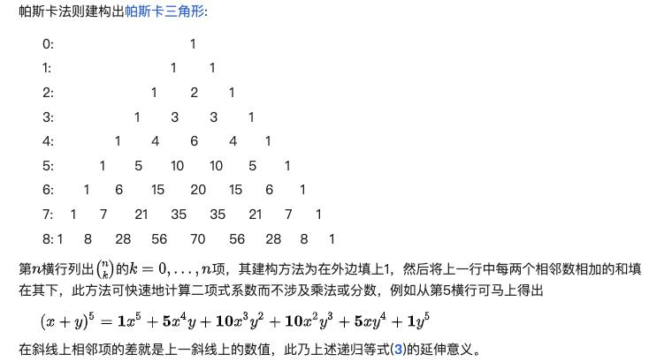
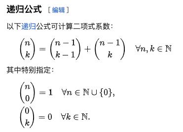

[https://cs184.eecs.berkeley.edu/sp24/lecture/8-24/mesh-processing-and-geometry-pro](https://cs184.eecs.berkeley.edu/sp24/lecture/8-24/mesh-processing-and-geometry-pro)  
The half-edge data structure is designed such that each half-edge has pointers to  
(1) the opposite half-edge, called its twin,  
(2) the next half-edge CCW（counterclockwise 逆时针） around the face associated with the half-edge, and  
(3) the vertex that is the "source" of the half-edge,  
(4) its associated edge, and 
(5) its associated face as explained above.

[https://rodolphe-vaillant.fr/entry/70/laplacian-smoothing-c-code-to-smooth-a-mesh](https://rodolphe-vaillant.fr/entry/70/laplacian-smoothing-c-code-to-smooth-a-mesh)
[https://github.com/brainexcerpts/laplacian_smoothing_triangle_mesh/blob/main/src/smooth_alg.cpp](https://github.com/brainexcerpts/laplacian_smoothing_triangle_mesh/blob/main/src/smooth_alg.cpp)

obj的描述文件中，face的每个坐标指的是其3个顶点，那么对应的edge是没有办法直接描述的，唯一能够直接使用的方案是什么呢？
怎么来描述每一条边界呢？

edge只能使用其顶点和面来做描述
在方案A中，使用的就是顶点+
是不是就是第一个ring中的3个顶点，然后是按照先后顺序来做的排列。
找到对应面的3个点是不是就行了
在做运算的时候，是用矩阵xV，而不是Vx矩阵
这里的vector3f其实和vertex是一个东西，那么怎么转换呢？
怎么初始化一个Vector3f?  

二项式系数，本质上就是（x+1）的n次方， 




	```mermaid
	graph TD
	A(工业用地效率)-->B1(土地利用强度)
	A-->B2(土地经济效益)
	B1-->C1(容积率)
	B1-->C2(建筑系数)
	B1-->C3(亩均固定资本投入)
	B2-->D1(亩均工业产值)
	B2-->D2(亩均税收)
	```

